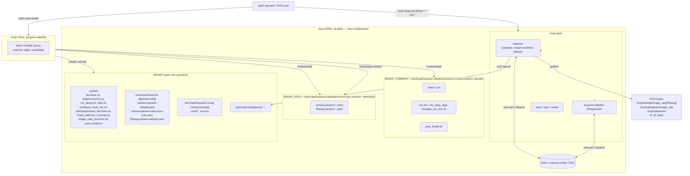

# ARCHITECTURE.md — `husarion-depthai-snap`

> Architecture documentation for engineers (humans and AI). Update on meaningful changes: adding/removing apps, new hooks, command-chain changes, new dependency, confinement change, build strategy change.

______________________________________________________________________

## 1. Overview

`husarion-depthai` is a **strict-confinement snap** containing a complete ROS 2 node with the Luxonis OAK-x camera driver (`depthai-ros`), wrapped in a configuration layer typical of Husarion snaps (`driver.*` + `ros.*` via `snap set`, DDS XML, ros.env, command-chain).



______________________________________________________________________

## 2. Tech stack

| Layer                | Technology                                                                                                                                 |
| -------------------- | ------------------------------------------------------------------------------------------------------------------------------------------ |
| Packaging            | snapcraft (\`extensions: ros2-{humble                                                                                                      |
| Manifest templating  | Jinja2 (`render_template.py` + `ROS_DISTRO` env var)                                                                                       |
| Application language | Python (ROS 2 launch), Bash (hooks + wrappers), C++ via `depthai-ros` (apt)                                                                |
| ROS 2                | `humble` or `jazzy` (matrix)                                                                                                               |
| Camera SDK           | `depthai-core` + `depthai_ros_driver` (apt: `ros-{distro}-depthai-ros`)                                                                    |
| Image transport      | `image_transport`, `image_transport_plugins`, `ffmpeg_image_transport` (libx264)                                                           |
| RMW                  | FastDDS (default from extension) + Cyclone DDS (`rmw-cyclonedds-cpp`) + Zenoh (`rmw-zenoh-cpp`); selected at runtime                        |
| DDS XML              | FastDDS profiles (UDP, SHM) + CycloneDDS XML (UDP localhost) + Zenoh json5. Files in `husarion-snap-common@0.13.0`.                        |
| CI                   | GitHub Actions (`snapcore/action-build`, `snapcore/action-publish`) + `pre-commit` (mdformat) in `ci.yaml`                                 |
| Build orchestration  | `just` (justfile)                                                                                                                          |
| External shared      | [`husarion/husarion-snap-common@0.13.0`](https://github.com/husarion/husarion-snap-common) — common ROS configuration / hooks / validators |

______________________________________________________________________

## 3. Directory layout

```
husarion-depthai-snap/
├── snapcraft_template.yaml.jinja2   # SOURCE OF TRUTH for the snap manifest
├── render_template.py               # Jinja renderer (CLI: in.jinja2 out.yaml; ROS_DISTRO from env)
├── snap/
│   ├── snapcraft.yaml               # ARTIFACT (gitignored) — generated from Jinja
│   ├── gui/icon.png                 # snap icon
│   ├── hooks/
│   │   ├── install                  # calls install_hook_ros.sh + apply_defaults.sh, copies yamls to $SNAP_DATA, post_install.sh to $SNAP_COMMON
│   │   ├── post-refresh             # migrates legacy customs from $SNAP_COMMON, overwrites bundled yamls in $SNAP_DATA, runs apply_defaults.sh
│   │   └── configure                # validates driver.*, inline check of yamls in $SNAP_DATA, calls configure_hook_ros.sh, restarts daemon
│   └── local/                       # (snap part: plugin: dump) → mapped to $SNAP/usr/bin and /share
│       ├── launcher.sh              # entry point for both apps
│       ├── depthai.launch.py        # ROS 2 launch (ComposableNodeContainer)
│       ├── apply_defaults.sh        # idempotent driver.* defaults; called by install + post-refresh
│       ├── camera-probe.py          # depthai capability probe (SPEC-camera-config; run by the camera concern apply hook)
│       ├── image_view_launcher.sh   # helper for previewing RGB via ffmpeg image transport
│       ├── post_install.sh          # snap connect raw-usb/hardware-observe/shm + restart daemon
│       ├── camera-params-default.yaml          # RGB preset (host re-encode)
│       ├── camera-params-rgb-h264-720p30.yaml  # chip H.264 only (rgb-h264-* family)
│       ├── camera-params-rgb-raw-720p-h264-720p.yaml  # dual: raw + chip H.264 (rgb-raw-*-h264-* family, custom plugin)
│       ├── camera-params-rgbd-rgb-h264-720p-depth-raw-disp-h264.yaml  # RGB+depth dual (RGBDDual)
│       ├── camera-params-oak-d-pro-poe.yaml    # RGBD + PoE preset (i_ip: 10.15.20.6)
│       └── ffmpeg-params-default.yaml          # libx264 / ultrafast / zerolatency
├── ros/
│   └── husarion_depthai_pipeline/   # custom depthai_ros_driver BasePipeline plugin (ament/colcon, NO fork)
│       ├── src/{rgb_dual,depth_dual,dual_pipeline}.cpp   # RGBDual / DepthDual nodes + plugin classes
│       ├── plugins.xml              # pluginlib export (RGBDual, RGBDDual) → autoloaded via camera.i_pipeline_type
│       └── CMakeLists.txt
├── justfile                         # build / install / iterate / publish / swap-enable (8G) / lxd-cache
├── README.md                        # README for the end user
├── LICENSE                          # Apache-2.0
├── CLAUDE.md                        # AI guidelines (THIS kind of file)
├── ARCHITECTURE.md                  # this file
├── .github/workflows/
│   ├── ci.yaml                      # PR + push main — pre-commit (mdformat) lint gate
│   ├── build.yaml                   # PR + workflow_dispatch — builds matrix (humble, jazzy) on ubuntu-latest
│   └── publish.yaml                 # push main / tag — matrix (humble, jazzy) × (amd64, arm64) → release to Snap Store
├── demo/                            # AD-HOC (test-only; may be removed)
│   ├── compose.yaml                 # docker compose with RViz
│   ├── default.rviz                 # RViz configuration
│   └── rviz.launch.py               # launch with ffmpeg→raw decoder
├── squashfs-root/                   # ARTIFACT from `unsquashfs` (gitignored)
└── husarion-depthai_*.snap          # BUILD ARTIFACTS (gitignored)
```

### Where things go in the final snap

| Source                                                         | Destination in the snap                                                                                                             | Mechanism                                                                                                                                               |
| -------------------------------------------------------------- | ----------------------------------------------------------------------------------------------------------------------------------- | ------------------------------------------------------------------------------------------------------------------------------------------------------- |
| `snap/local/*.sh`                                              | `$SNAP/usr/bin/`                                                                                                                    | part `local-files` (plugin: dump)                                                                                                                       |
| `snap/local/*.py`                                              | `$SNAP/usr/bin/`                                                                                                                    | same as above                                                                                                                                           |
| `snap/local/*.yaml`                                            | `$SNAP/usr/share/husarion-depthai/config/` (read-only template) → `$SNAP_DATA/` (writable runtime via install + post-refresh hooks) | same as above + hooks                                                                                                                                   |
| `husarion-snap-common@0.13.0/local-ros/*.sh`                   | `$SNAP/usr/bin/`                                                                                                                    | part `husarion-snap-common` (plugin: dump from git)                                                                                                     |
| `husarion-snap-common@0.13.0/local-ros/*.xml`                  | `$SNAP/usr/share/husarion-snap-common/config/`                                                                                      | same as above                                                                                                                                           |
| `husarion-snap-common@0.13.0/local-ros/ros.env`                | `$SNAP/usr/share/husarion-snap-common/config/`                                                                                      | same as above                                                                                                                                           |
| `yq` from GitHub releases (v4.35.1)                            | `$SNAP/usr/bin/yq`                                                                                                                  | override-build + override-prime                                                                                                                         |
| apt: `ros-{distro}-depthai-ros` (+ image_transport, ffmpeg, …) | `$SNAP/opt/ros/{distro}/...`                                                                                                        | stage-packages in part `husarion-depthai`                                                                                                               |
| `ros/husarion_depthai_pipeline/`                               | `$SNAP/opt/ros/{distro}/lib/libhusarion_depthai_pipeline.so` (+ plugins.xml, ament index)                                           | part `husarion-depthai-pipeline` (plugin: colcon) — built against the staged driver; pluginlib autoloads it when a preset sets `camera.i_pipeline_type` |

______________________________________________________________________

## 4. Domain models

### Snap parameters (external contract)

```
husarion-depthai (snap)
├── driver.*                              # DepthAI-specific; handled by snap/hooks/configure
│   ├── name              = oak           # node name; regex ^[a-z_-]{1,10}$
│   ├── camera-model      = OAK-D-PRO     # OAK-D | OAK-D-LITE | OAK-1 | OAK-1-LITE | OAK-D-PRO | OAK-D-PRO-W
│   │                                       # snap-side validation only; depthai driver autodetects hardware
│   ├── camera-params     = default       # name of camera-params-<NAME>.yaml in $SNAP_DATA
│   │                                       # bundled: default, oak-1-lite, oak-d-pro, oak-d-pro-poe
│   ├── ffmpeg-params     = default       # name of ffmpeg-params-<NAME>.yaml in $SNAP_DATA
│   ├── startup-delay     = 30            # seconds 0-120 (allow-unset); workaround for USB cold-start race after reboot
│   ├── enable-pointcloud = false         # bool; load PointCloudXyzrgbNode + force RGB/stereo sync
│   └── rectify-rgb       = true          # bool; load image_proc::RectifyNode (forced off for raw-less presets)
│
└── ros.*                                 # shared; handled by configure_hook_ros.sh from snap-common
    ├── domain-id         = 0             # 0..232
    ├── localhost-only    = ''            # 0|1 (humble); allow-unset
    ├── transport         = udp           # udp/shm/udp-lo, fastdds/<X>, cyclonedds/<X>, rmw_fastrtps_cpp, rmw_cyclonedds_cpp
    ├── namespace         = ''            # regex ^[0-9a-z_-]{1,20}$ (allow-unset)
    ├── automatic-discovery-range = ''    # subnet|localhost|off|system_default (jazzy only, allow-unset)
    └── static-peers      = ''            # IPv4/IPv6/hostname; ; separated (jazzy only, allow-unset)
```

### Key file naming conventions

- `camera-params-<NAME>.yaml` — `depthai_ros_driver::Camera` parameters (sections `camera`, `imu`, `rgb`, `diagnostic_updater`)
- `ffmpeg-params-<NAME>.yaml` — `ffmpeg_image_transport` parameters (encoding, preset, tune)
- `rmw/<impl>/<NAME>.xml` — FastDDS profile (`xmlns="http://www.eprosima.com/XMLSchemas/fastRTPS_Profiles"`) or CycloneDDS (`xmlns="https://cdds.io/config"`). Type detected by `check_xml_profile_type` in `utils.sh`.

### ROS topics published (full RGBD pipeline)

```
/<ns>/<name>/rgb/image_raw                  # sensor_msgs/Image (BGR8) — conditionally lazy
/<ns>/<name>/rgb/image_raw/ffmpeg           # libx264 stream (ffmpeg image transport)
/<ns>/<name>/rgb/camera_info                # sensor_msgs/CameraInfo
/<ns>/<name>/rgb/image_rect[/...]           # only if rectify_rgb=true (image_proc::RectifyNode)
/<ns>/<name>/stereo/image_raw               # depth (if i_pipeline_type: RGBD)
/<ns>/<name>/points                         # PointCloud2 (from PointCloudXyzrgbNode)
```

With a dual-output preset (`camera.i_pipeline_type: husarion_depthai::pipeline_gen::RGBDual` / `RGBDDual`, the custom plugin in `ros/`) the same camera additionally publishes the OAK chip's hardware H.264 alongside the raw, simultaneously — `/<ns>/<name>/rgb/image_raw/compressed` (FFMPEGPacket, on-chip), and for `RGBDDual` also `/<ns>/<name>/stereo/image_raw/compressed` (disparity grayscale H.264, a lossy 2D depth *view*; the metric 16UC1 depth stays on `/stereo/image_raw`). Those presets set `oak.rgb.image_raw.enable_pub_plugins: ['image_transport/raw']` so the raw stream's transport republishers don't collide with the on-chip FFMPEGPacket on `…/compressed`. See README.md / snap/local/AGENTS.md for the preset family + the depth `i_subpixel=false` constraint.

______________________________________________________________________

## 5. Data and control flow

### A. Build (local)

```
ROS_DISTRO=jazzy   ──► ./render_template.py snapcraft_template.yaml.jinja2 snap/snapcraft.yaml
                       │
                       └─► snapcraft (with SNAPCRAFT_ENABLE_EXPERIMENTAL_EXTENSIONS=1)
                              ├── apt-get stage-packages (depthai-ros, image_transport, ffmpeg, cv-bridge,
                              │   ffmpeg-image-transport, rmw-cyclonedds-cpp, libpulse-dev, libblas3, libjpeg-turbo8-dev)
                              ├── git clone husarion-snap-common@0.13.0 → dump
                              ├── snap/local/ → dump
                              ├── curl yq → bin
                              ├── execstack -c libamdhip64.so* (part of fix-execstack)
                              └── version = `apt-cache policy ros-{distro}-depthai-ros-driver | Candidate`
                       │
                       └─► husarion-depthai_<version>_<arch>.snap (~543 MB)
```

### B. Install / refresh on the host

```
sudo snap install husarion-depthai
        │
        ▼
hook install:
  install_hook_ros.sh      → defaults ros.transport=udp, ros.domain-id=0, ros.namespace=''
                            copies DDS XML from $SNAP/usr/share/husarion-snap-common/config/*.xml → $SNAP_COMMON/
  apply_defaults.sh        → idempotent set of driver.* defaults
  cp $SNAP/usr/share/husarion-depthai/config/*.yaml → $SNAP_DATA/   # bundled presets
  cp $SNAP/usr/bin/post_install.sh → $SNAP_COMMON/                  # user-facing helper
  if !is-connected raw-usb: log "please run snap connect ..."

hook post-refresh (fires on every `snap refresh`, NOT on first install):
  cp $SNAP_COMMON/{camera,ffmpeg}-params-*.yaml → $SNAP_DATA/  # one-shot migrate legacy customs (skip if exists)
  cp $SNAP/usr/share/husarion-depthai/config/*.yaml → $SNAP_DATA/   # always overwrite bundled presets
  apply_defaults.sh        → set defaults for any new driver.* params introduced in this revision
        │
        ▼
hook configure (also fires after install):
  validate_keys "driver" / regex / option / float / number / config_param
  configure_hook_ros.sh:
    ├── validates ros.* (differently for humble vs jazzy)
    ├── exports to $SNAP_COMMON/ros.env: ROS_DOMAIN_ID, ROS_LOCALHOST_ONLY,
    │   ROS_NAMESPACE, RMW_IMPLEMENTATION, FASTRTPS_DEFAULT_PROFILES_FILE | CYCLONEDDS_URI,
    │   ROS_AUTOMATIC_DISCOVERY_RANGE (jazzy), ROS_STATIC_PEERS (jazzy)
    ├── duplicates current values to $SNAP_COMMON/ros_snap_args (one-liner)
    └── generates $SNAP_COMMON/manage_ros_env.sh (add/remove `source ros.env` in ~/.bashrc)
  for service in daemon: snapctl restart husarion-depthai.daemon (if enabled)
        │
        ▼
USER (manual, one-shot): sudo /var/snap/husarion-depthai/common/post_install.sh
  snap connect husarion-depthai:raw-usb
  snap connect husarion-depthai:hardware-observe
  snap connect husarion-depthai:shm-plug husarion-depthai:shm-slot
  husarion-depthai.restart
```

### C. Runtime — daemon start

```
systemd: husarion-depthai.daemon.service (restart-condition: always)
        │
        ▼ command-chain[0]
ros_setup.sh:
  ROS_ENV_FILE = $SNAP_COMMON/ros.env (copied from snap-common if missing)
  source $ROS_ENV_FILE  → exports RMW_IMPLEMENTATION, ROS_DOMAIN_ID, ROS_NAMESPACE, ...
  exec "$@"
        │
        ▼ command
launcher.sh:
  collect driver.{name,enable-pointcloud,rectify-rgb}
  (forces rectify-rgb + enable-pointcloud off for raw-less presets: rgb-h264-*, depth-disp-h264)
  → LAUNCH_OPTIONS (kebab → snake)
  + namespace:= ros.namespace (if set)
  + params_file := $SNAP_DATA/camera-params-${driver.camera-params}.yaml
  + ffmpeg_params_file := $SNAP_DATA/ffmpeg-params-${driver.ffmpeg-params}.yaml

  STARTUP_DELAY logic (uptime-based):
    UPTIME = int(/proc/uptime)
    if STARTUP_DELAY > 0 and UPTIME < STARTUP_DELAY + 60: sleep ${STARTUP_DELAY}
    # else: no delay — daemon is starting "second-hand" (snap restart, refresh, crash recovery)

  ros2 launch $SNAP/usr/bin/depthai.launch.py ${LAUNCH_OPTIONS}
        │
        ▼
depthai.launch.py:
  ComposableNodeContainer(name="${driver.name}_container", namespace=ros.namespace)
    ├── depthai_ros_driver::Camera (params_file + tf_params)        ←──→ USB OAK-x
    ├── image_proc::RectifyNode (conditionally IfCondition rectify_rgb)
    └── depth_image_proc::PointCloudXyzrgbNode (conditionally IfCondition enable_pointcloud)
```

### D. Runtime — `snap set` triggers reconfiguration

```
sudo snap set husarion-depthai driver.startup-delay=5
        │
        ▼
hook configure: validate → restart daemon (if enabled)
        │
        ▼
launcher.sh starts from scratch with the new values
```

______________________________________________________________________

## 6. External integrations

| Integration            | Method                                                                    | Pinned version                                                             |
| ---------------------- | ------------------------------------------------------------------------- | -------------------------------------------------------------------------- |
| `husarion-snap-common` | git clone in `parts.husarion-snap-common.source`                          | branch/tag `0.13.0`                                                        |
| `depthai-ros`          | apt (`ros-{distro}-depthai-ros`) from the ROS 2 distro repo               | dynamic (`apt-cache policy …\| Candidate`)                                 |
| `yq`                   | curl from GitHub releases                                                 | `v4.35.1`                                                                  |
| ROS 2 base             | snapcraft extension `ros2-{distro}-ros-base`                              | distro = humble \| jazzy                                                   |
| Snap Store             | `snapcore/action-publish@v1`                                              | tracks: `humble/edge`, `humble/candidate`, `jazzy/edge`, `jazzy/candidate` |
| OAK-x camera           | USB (raw-usb plug) or PoE/IP (preset `oak-d-pro-poe`, `i_ip: 10.15.20.6`) | —                                                                          |

______________________________________________________________________

## 7. Architectural decisions

### D1. Snap manifest generated from Jinja

**Why**: two ROS distros (humble/jazzy) → different `base:` and extension. Without a template we'd maintain 2 nearly-identical snapcraft.yaml files.

**Consequence**: `snap/snapcraft.yaml` is an artifact (gitignored), tooling has to remember to render — `justfile` and CI do that.

### D2. Extracting shared parts to `husarion-snap-common`

**Why**: identical hooks, validators, DDS XML, start/stop wrappers exist in many Husarion snaps (rosbot, webui, depthai…). Hosting them in a library shares the maintenance cost.

**Consequence**: cross-snap changes go through a PR to common + a pin bump in each consuming repo. Don't patch local copies.

### D3. `depthai-ros` from apt (not from source)

**Why**: a `colcon` build from `luxonis/depthai-ros` was slow and brittle (commit c986807 "install snap from apt packages"). apt is deterministic and 10× faster.

**Consequence**: snap version = apt Candidate. Upstream bug → wait for a package release. No way to use a commit-level pin.

### D4. Startup-delay via uptime check

**Why**: `depthai_ros_driver::Camera` has a startup race after a fresh boot — the USB camera isn't ready yet and the driver crashes. Workaround: delay the start, but **only when we started shortly after system boot** (`/proc/uptime < STARTUP_DELAY + 60s`). In other cases (manual restart, refresh, crash recovery) we go without a delay.

**Earlier implementation** (up to `ecf72d9`, 2025-11-27): a flag file in `$SNAP_DATA/.startup-delay-done` + `exit 0` + `restart-condition: always` — the first iteration slept, the second (after a systemd restart) ran `ros2 launch`. It worked for the golden path, but: (a) risk of an infinite `sleep → launch fail → restart → sleep → …` loop, (b) the flag was deleted in iter 2, so every snap restart also paid the delay, (c) hard-to-follow logic with three coupled components.

**Current solution** ([snap/local/launcher.sh:63-71](snap/local/launcher.sh#L63)) is a clean branch on `int(/proc/uptime)`. Deterministic, requires only `/proc` (available under strict confinement without any plug). `restart-condition: always` stays on the daemon as general post-crash resilience, independent of the workaround.

**Status**: heuristic workaround. To be re-validated on every `ros-{distro}-depthai-ros` bump (procedure in [CLAUDE.md → "Before bumping apt dependencies"](CLAUDE.md)).

**Resolved**: the earlier `ros2 daemon stop && sleep 1` before `ros2 launch` (from commit 8f874b "test") has since been removed — `launcher.sh` now calls `ros2 launch` directly after the optional startup-delay sleep.

### D5. Two apps (`daemon` + foreground `husarion-depthai`)

**Why**: 99% of production cases = service. Foreground needed for debug and interactive sessions.

**Consequence**: both use the same `launcher.sh`. Foreground requires the daemon to be stopped — enforced by `check_daemon_running.sh` in the command-chain.

### D6. Strict confinement + shared-memory slot/plug within the same snap

**Why**: ROS 2 with FastDDS in SHM mode needs access to `/dev/shm`. Strict confinement blocks foreign SHM by default. The snap declares its *own* shared-memory slot and connects to it (auto-connect after `post_install.sh`).

### D7. `fix-execstack` for `libamdhip64.so*`

**Why**: AMD HIP runtime (pulled in indirectly via OpenCV / cv-bridge / ffmpeg) has execstack ON, which snapd blocks under strict confinement. `execstack -c` neutralizes it without abandoning strict.

**Consequence**: if a new lib with execstack ON shows up, add it to `choosen_files` in `fix-execstack`. The build needs the apt `execstack` package.

### D8. Pointcloud controlled via `driver.*`, not via the params YAML

**Why**:

- `enable-pointcloud` is a "launch topology" decision (whether to load `PointCloudXyzrgbNode`), not a driver parameter per se. Keeping it in `snap set` gives opt-in without modifying `camera-params-*.yaml` per host.
- Sync overrides (`pipeline_gen.i_enable_sync`, `rgb.i_synced`, `stereo.i_synced`) are injected in launch.py when `enable-pointcloud=true` — mirroring what upstream `camera.launch.py` does on `pointcloud.enable=true`.

**Consequence**: `camera-params-*.yaml` describe ONLY driver parameters (sensors, pipeline, IMU). Launch toggles live in `driver.*` in the snap. Boundary clear.

### D9. Custom `depthai.launch.py` instead of delegating to upstream `camera.launch.py`

**Why we keep our own launch**:

- Composable node naming (`<name>_rectify_color_node` instead of upstream `rectify_color_node`) — preparation for multicam.
- No dependency on `urdf_launch.py` from `depthai_descriptions` — Husarion has its own robot URDF.

**Coverage versus upstream `camera.launch.py` jazzy 2.12.2**:

| Upstream feature                                                                 | Status here                                                       |
| -------------------------------------------------------------------------------- | ----------------------------------------------------------------- |
| `ParameterFile(LaunchConfiguration("params_file"), allow_substs=True)`           | ✅                                                                |
| `IfCondition(rectify_rgb)` + RectifyNode                                         | ✅ (per-camera name)                                              |
| `IfCondition(pointcloud.enable)` + PointCloudXyzrgbNode                          | ✅ as `enable_pointcloud`                                         |
| Sync overrides (`pipeline_gen.i_enable_sync`, `rgb.i_synced`, `stereo.i_synced`) | ✅ injected when PCL on                                           |
| `tf_params` from `publish_tf_from_calibration` + `override_cam_model`            | ❌ removed as dead (Husarion uses own robot URDF; would conflict) |
| `target_container` namespace-aware                                               | ✅ (with leading `/`)                                             |
| Default `camera_model="OAK-D-PRO"`                                               | ✅ aligned (also in `snap/hooks/install`)                         |
| Default `rectify_rgb="true"`                                                     | ✅ aligned                                                        |
| `Node(rviz2)` + `use_rviz`                                                       | ❌ not needed (we have `image_view_launcher.sh`)                  |
| `IncludeLaunchDescription(urdf_launch.py)`                                       | ❌ deliberately omitted                                           |
| `rs_compat` (RealSense compat) + `enable_color/depth/infra*`, `*_profile` args   | ❌ deliberately omitted                                           |
| `setup_launch_prefix` (gdb/valgrind/perf)                                        | ❌ omitted (snap strict confinement limits debug tools anyway)    |

**Future decision**: could switch to `IncludeLaunchDescription(camera.launch.py)` mapping our `driver.*` to upstream args, but we'd lose control over node naming. Low priority — current coverage is complete.

### D10. Snap Store channels: branch → edge, tag → candidate

**Why**: `main` has working code, but not necessarily production-tested → `edge`. Git tags = intentional release → `candidate` (manually promoted to stable from there).

______________________________________________________________________

## 8. Extension points

| Add                                         | Where                                                                                                                     |
| ------------------------------------------- | ------------------------------------------------------------------------------------------------------------------------- |
| New `driver.X` parameter                    | `snap/hooks/{configure,install}` + `snap/local/{launcher.sh,depthai.launch.py}` (4 spots)                                 |
| New camera YAML preset                      | add `camera-params-<NAME>.yaml` to `snap/local/`                                                                          |
| New ffmpeg YAML preset                      | add `ffmpeg-params-<NAME>.yaml` to `snap/local/`                                                                          |
| New DDS transport                           | PR to `husarion/husarion-snap-common` (`local-ros/rmw/<impl>/<NAME>.xml`) + bump pin in Jinja                             |
| New apt dependency                          | `snapcraft_template.yaml.jinja2` → `parts.husarion-depthai.stage-packages`                                                |
| New plug (e.g. `gpio`)                      | `snapcraft_template.yaml.jinja2` → `apps.daemon.plugs` + `apps.husarion-depthai.plugs` + `post_install.sh` (snap connect) |
| New ROS distro (e.g. `kilted`)              | Jinja conditions on `core` per distro + matrix in CI + entry in `justfile`                                                |
| New app (e.g. `husarion-depthai.calibrate`) | new entry in `apps:` in Jinja + script in `snap/local/`                                                                   |
| New parameter validator                     | edit `husarion-snap-common/local-ros/utils.sh` + bump pin                                                                 |

______________________________________________________________________

## 9. Known limitations / technical debt

1. **"startup-delay" workaround** — heuristic, not a root-cause fix. The uptime-based mechanism is simple and deterministic, but assumes that `int(/proc/uptime) < STARTUP_DELAY + 60s` is a good proxy for "fresh boot". Sanity-check procedure on a depthai-ros bump: [CLAUDE.md → "Before bumping apt dependencies"](CLAUDE.md).

2. ~~`${SNAP_COMMON}` is not synced on refresh~~ — **resolved**: yaml presets live in `${SNAP_DATA}` and are refreshed by the `post-refresh` hook. User customs survive (snapd copies `$SNAP_DATA` per revision). Legacy customs from `$SNAP_COMMON` are migrated once.

3. **`ros2-{distro}-ros-base` extension requires an experimental flag** — `SNAPCRAFT_ENABLE_EXPERIMENTAL_EXTENSIONS=1`. If that flag is removed/renamed, the build breaks.

4. **`fix-execstack` requires apt `execstack`** — may be unavailable in some core24 configurations. If so, `just swap-enable` or a beefier machine helps (LXD OOM).

5. **`demo/`** — unofficial, scheduled for removal (compose + RViz). Don't treat it as part of the supported surface.

6. **`humble` track** — actively maintained (CI matrix), but ROS 2 Humble is pre-EOL; users will be migrated to `jazzy`.

7. **Snap version = apt Candidate** — if the apt cache is stale on a GH Actions runner, the version may shift between builds on the same day.

8. **No unit/integration tests** — the only validation is "snap install --dangerous" in CI. Runtime regressions (e.g. a change in `launcher.sh`) are caught only by manual launch on the target platform.

9. **Snap size ~543 MB** — large surface, long `snap download`/`refresh`. Most of it is ROS 2 base + depthai-ros + ffmpeg. Optimizing via `stage-snaps` instead of `stage-packages` would be possible but unverified.

______________________________________________________________________

## 10. Release cycle

```
git push main           ──► CI publish.yaml ──► matrix(humble,jazzy)×(amd64,arm64) ──► <distro>/edge
git tag vX.Y.Z          ──► CI publish.yaml ──►        ”                          ──► <distro>/candidate
manual promotion        ──► snapcraft release husarion-depthai <revision> <distro>/stable
```

Changes verified on PR via `build.yaml` (matrix only humble+jazzy on amd64) → `snap install --dangerous` as a smoke test.
