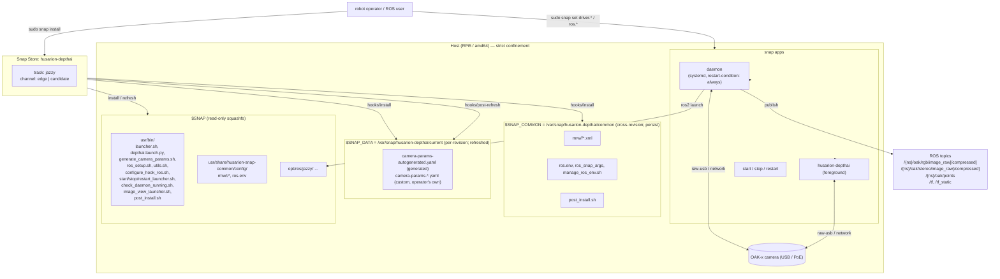

# ARCHITECTURE.md — `husarion-depthai-snap`

> Architecture documentation for engineers (humans and AI). Update on meaningful changes: adding/removing apps, new hooks, command-chain changes, new dependency, confinement change, build strategy change.

______________________________________________________________________

## 1. Overview

`husarion-depthai` is a **strict-confinement snap** containing a complete ROS 2 node with the Luxonis OAK-x camera driver (`depthai-ros`), wrapped in a configuration layer typical of Husarion snaps (`driver.*` + `ros.*` via `snap set`, DDS XML, ros.env, command-chain).


```mermaid
flowchart TB
    User["robot operator / ROS user"]

    subgraph SnapStore["Snap Store: husarion-depthai"]
        Tracks["track: jazzy<br/>channel: edge | candidate"]
    end

    subgraph Host["Host (RPi5 / amd64) — strict confinement"]
        subgraph SnapMount["$SNAP (read-only squashfs)"]
            Bin["usr/bin/<br/>launcher.sh, depthai.launch.py,<br/>generate_camera_params.sh,<br/>ros_setup.sh, utils.sh,<br/>configure_hook_ros.sh,<br/>start/stop/restart_launcher.sh,<br/>check_daemon_running.sh,<br/>image_view_launcher.sh,<br/>post_install.sh"]
            CommonConf["usr/share/husarion-snap-common/config/<br/>rmw/<impl>/*, ros.env"]
            Ros["opt/ros/jazzy/ ..."]
        end

        subgraph Data["$SNAP_DATA = /var/snap/husarion-depthai/current (per-revision; refreshed)"]
            Yamls["camera-params-autogenerated.yaml (generated)<br/>camera-params-*.yaml (custom, operator's own)"]
        end

        subgraph Common["$SNAP_COMMON = /var/snap/husarion-depthai/common (cross-revision; persist)"]
            Dds["rmw/<impl>/*.xml"]
            Env["ros.env, ros_snap_args, manage_ros_env.sh"]
            Post["post_install.sh"]
        end

        subgraph Apps["snap apps"]
            Daemon["daemon<br/>(systemd, restart-condition: always)"]
            FG["husarion-depthai (foreground)"]
            Start["start / stop / restart"]
        end

        Cam[("OAK-x camera (USB / PoE)")]
    end

    User -->|sudo snap install| SnapStore
    SnapStore -->|install / refresh| SnapMount
    SnapStore -->|hooks/install| Data
    SnapStore -->|hooks/post-refresh| Data
    SnapStore -->|hooks/install| Common

    User -->|sudo snap set driver.* / ros.*| Apps
    Apps --> Daemon
    Apps --> FG

    Daemon -->|ros2 launch| Ros
    Daemon <-->|raw-usb / network| Cam
    FG <-->|raw-usb / network| Cam

    Daemon -->|publish| Topics["ROS topics<br/>/{ns}/oak/rgb/image_raw[/compressed]<br/>/{ns}/oak/stereo/image_raw[/compressed]<br/>/{ns}/oak/points<br/>/tf, /tf_static"]
```

______________________________________________________________________

## 2. Tech stack

| Layer | Technology |
| -- | -- |
| Packaging | snapcraft (`extensions: ros2-jazzy-ros-base`) |
| Manifest templating | Jinja2 (`render_template.py` + `ROS_DISTRO` env var — jazzy only, kept templated for a possible future distro) |
| Application language | Python (ROS 2 launch), Bash (hooks + wrappers), C++ via `depthai-ros` (apt) |
| ROS 2 | `jazzy` only (`humble` support dropped 2026-08) |
| Camera SDK | `depthai-core` + `depthai_ros_driver` (apt: `ros-{distro}-depthai-ros`) |
| Image transport | `image_transport`, `image_transport_plugins`, `ffmpeg_image_transport_msgs` (message defs; the on-chip H.264 path builds `FFMPEGPacket` itself, no plugin needed), `ffmpeg_image_transport` + `ffmpeg` CLI (real software plugin, used ONLY for the rectified `image_rect` stream — no hardware path exists for it) |
| RMW | FastDDS (default from extension) + Cyclone DDS (`rmw-cyclonedds-cpp`) + Zenoh (`rmw-zenoh-cpp`); selected at runtime |
| DDS XML | FastDDS profiles (UDP, SHM) + CycloneDDS XML (UDP localhost) + Zenoh json5. Files in `husarion-snap-common@0.13.0`. |
| CI | GitHub Actions (`snapcore/action-build`, `snapcore/action-publish`) + `pre-commit` (mdformat) in `ci.yaml` |
| Build orchestration | `just` (justfile) |
| External shared | [`husarion/husarion-snap-common@0.13.0`](https://github.com/husarion/husarion-snap-common) — common ROS configuration / hooks / validators |

______________________________________________________________________

## 3. Directory layout

```
husarion-depthai-snap/
├── snapcraft_template.yaml.jinja2   # SOURCE OF TRUTH for the snap manifest
├── render_template.py               # Jinja renderer (CLI: in.jinja2 out.yaml; ROS_DISTRO from env)
├── snap/
│   ├── snapcraft.yaml               # ARTIFACT (gitignored) — generated from Jinja
│   ├── gui/icon.png                 # snap icon
│   ├── hooks/
│   │   ├── install                  # calls install_hook_ros.sh + apply_defaults.sh, post_install.sh to $SNAP_COMMON (configure generates camera-params right after)
│   │   ├── post-refresh             # migrates legacy customs from $SNAP_COMMON, seeds rmw tree if missing, runs apply_defaults.sh
│   │   └── configure                # validates driver.*, (re)generates camera-params-autogenerated.yaml, calls configure_hook_ros.sh, restarts daemon
│   └── local/                       # (snap part: plugin: dump) → mapped to $SNAP/usr/bin and /share
│       ├── launcher.sh              # entry point for both apps
│       ├── depthai.launch.py        # ROS 2 launch (ComposableNodeContainer) — loads params_file verbatim, no runtime overrides
│       ├── generate_camera_params.sh # driver.depth/resolution/fps/imu/ir/ip -> camera-params-autogenerated.yaml (run by configure)
│       ├── apply_defaults.sh        # idempotent driver.* defaults; called by install + post-refresh
│       ├── camera-probe.py          # depthai capability probe; run by the husarion-agent-extras camera concern hook
│       └── post_install.sh          # snap connect raw-usb/hardware-observe/shm (no restart — daemon starts via .start)
├── ros/
│   └── husarion_depthai_pipeline/   # custom depthai_ros_driver BasePipeline plugin (ament/colcon, NO fork)
│       ├── src/{rgb_dual,depth_dual,dual_pipeline}.cpp   # RGBDual / DepthDual nodes + plugin classes
│       ├── plugins.xml              # pluginlib export (RGBDual, RGBDDual) → autoloaded via camera.i_pipeline_type
│       └── CMakeLists.txt
├── justfile                         # build / install / iterate / publish / swap-enable (8G) / lxd-cache
├── README.md                        # README for the end user
├── LICENSE                          # Apache-2.0
├── CLAUDE.md                        # AI guidelines (THIS kind of file)
├── ARCHITECTURE.md                  # this file
├── .github/workflows/
│   ├── ci.yaml                      # PR + push main — pre-commit (mdformat) lint gate
│   ├── build.yaml                   # PR + workflow_dispatch — builds jazzy on ubuntu-latest
│   └── publish.yaml                 # push main / tag — jazzy × (amd64, arm64) → release to Snap Store
├── squashfs-root/                   # ARTIFACT from `unsquashfs` (gitignored)
└── husarion-depthai_*.snap          # BUILD ARTIFACTS (gitignored)
```

### Where things go in the final snap

| Source | Destination in the snap | Mechanism |
| -- | -- | -- |
| `snap/local/*.sh` | `$SNAP/usr/bin/` | part `local-files` (plugin: dump) |
| `snap/local/*.py` | `$SNAP/usr/bin/` | same as above |
| `husarion-snap-common@0.13.0/local-ros/*.sh` | `$SNAP/usr/bin/` | part `husarion-snap-common` (plugin: dump from git) |
| `husarion-snap-common@0.13.0/local-ros/*.xml` | `$SNAP/usr/share/husarion-snap-common/config/` | same as above |
| `husarion-snap-common@0.13.0/local-ros/ros.env` | `$SNAP/usr/share/husarion-snap-common/config/` | same as above |
| `yq` from GitHub releases (v4.35.1) | `$SNAP/usr/bin/yq` | override-build + override-prime |
| apt: `ros-{distro}-depthai-ros` (+ image_transport, image_transport_plugins, ffmpeg-image-transport{,-msgs}, ffmpeg CLI) | `$SNAP/opt/ros/{distro}/...` | stage-packages in part `husarion-depthai` |
| `ros/husarion_depthai_pipeline/` | `$SNAP/opt/ros/{distro}/lib/libhusarion_depthai_pipeline.so` (+ plugins.xml, ament index) | `colcon-packages` in part `husarion-depthai` (same part as the apt stage-packages above, since 2026-08 — see D-note in the Jinja template) — pluginlib autoloads it when `camera.i_pipeline_type` is set |

______________________________________________________________________

## 4. Domain models

### Snap parameters (external contract)

```
husarion-depthai (snap)
├── driver.*                              # DepthAI-specific; handled by snap/hooks/configure
│   ├── name              = oak           # node name; regex ^[a-z_-]{1,10}$
│   ├── model             = (unset)       # REQUIRED before start: OAK-D | OAK-D-LITE | OAK-1 | OAK-1-LITE | OAK-D-PRO | OAK-D-PRO-W
│   │                                       # snap-side validation only; depthai driver autodetects hardware
│   ├── camera-params     = autogenerated # name of camera-params-<NAME>.yaml in $SNAP_DATA
│   │                                       # "autogenerated" = compiled by generate_camera_params.sh from the keys below,
│   │                                       # on every configure run. Anything else = a hand-authored file, fully hands-off.
│   ├── startup-delay     = 30            # seconds 0-120 (allow-unset); workaround for USB cold-start race after reboot
│   ├── depth             = false         # RGBDual↔RGBDDual at launch. Rejected if true on OAK-1 / OAK-1-LITE.
│   ├── pointcloud        = false         # load PointCloudXyzrgbNode + force RGB/stereo sync; true CASCADES depth=true
│   ├── resolution        = 720P          # enum 720P|1080P|4K; overrides rgb.i_resolution
│   ├── fps               = 30            # number 1-60; overrides rgb.i_fps + H.264 keyframe cadence
│   ├── imu               = false         # rejected if true on a model with no IMU
│   ├── ir                = false         # IR laser dot + floodlight together; rejected if true unless OAK-D-PRO/OAK-D-PRO-W
│   ├── ip                = (unset)       # allow-unset IPv4; PoE target address — the one key with no default
│   └── rectify-rgb       = true          # bool; load image_proc::RectifyNode (forced off for raw-less presets)
│
└── ros.*                                 # shared; handled by configure_hook_ros.sh from snap-common
    ├── domain-id         = 0             # 0..232
    ├── localhost-only    = ''            # 0|1; ROS_LOCALHOST_ONLY; allow-unset
    ├── transport         = udp           # udp/shm/udp-lo, fastdds/<X>, cyclonedds/<X>, rmw_fastrtps_cpp, rmw_cyclonedds_cpp
    ├── namespace         = ''            # regex ^[0-9a-z_-]{1,20}$ (allow-unset)
    ├── automatic-discovery-range = ''    # subnet|localhost|off|system_default; allow-unset
    └── static-peers      = ''            # IPv4/IPv6/hostname; ; separated (jazzy only, allow-unset)
```

### Key file naming conventions

- `camera-params-<NAME>.yaml` — `depthai_ros_driver::Camera` parameters (sections `camera`, `imu`, `rgb`, `stereo`, `diagnostic_updater`). `NAME=autogenerated` is reserved (generated, never hand-edited); any other `NAME` is a custom, hands-off file.
- `rmw/<impl>/<NAME>.xml` — FastDDS profile (`xmlns="http://www.eprosima.com/XMLSchemas/fastRTPS_Profiles"`) or CycloneDDS (`xmlns="https://cdds.io/config"`). Type detected by `check_xml_profile_type` in `utils.sh`.

### ROS topics published (RGBD dual pipeline, `driver.depth=true`)

```
/<ns>/<name>/rgb/image_raw                  # sensor_msgs/Image (BGR8) — raw, autonomy
/<ns>/<name>/rgb/image_raw/ffmpeg           # ffmpeg_image_transport_msgs/FFMPEGPacket — ON-CHIP H.264 (~0 host CPU)
/<ns>/<name>/rgb/camera_info                # sensor_msgs/CameraInfo
/<ns>/<name>/rgb/image_rect                 # image_proc::RectifyNode — only if rectify_rgb=true
/<ns>/<name>/rgb/image_rect/ffmpeg          # REAL ffmpeg_image_transport plugin (host CPU — no hardware path for rectified)
/<ns>/<name>/rgb/image_rect/{compressed,zstd}  # other image_transport lazy republishers (still enabled; compressedDepth AND theora excluded — see enable_pub_plugins)
/<ns>/<name>/stereo/image_raw                    # depth 16UC1, metric, autonomy
/<ns>/<name>/stereo/image_raw/ffmpeg             # disparity grayscale H.264 — a lossy 2D depth *view*, telepresence (not metric)
/<ns>/<name>/stereo/image_raw/compressedDepth    # lazy SOFTWARE PNG depth compression (image_transport, on subscription only)
/<ns>/<name>/points                              # PointCloud2 (from PointCloudXyzrgbNode, if driver.pointcloud=true)
```

`husarion_depthai_pipeline` (the custom plugin, `ros/`) is unconditional — `camera-params-autogenerated.yaml` always sets `camera.i_pipeline_type` to `husarion_depthai::pipeline_gen::RGBDual` (RGB only) or `RGBDDual` (`driver.depth=true`), never a stock `RGB`/`RGBD` type. `generate_camera_params.sh` sets `oak.rgb.image_raw.enable_pub_plugins: ['image_transport/raw']` (and, when depth is on, `stereo.image_raw.enable_pub_plugins: ['image_transport/raw', 'image_transport/compressedDepth']`) so the raw stream's own lazy transport republishers don't collide with the on-chip FFMPEGPacket on `…/ffmpeg`, while still allowing the semantically-correct lazy software depth compressor. See README.md / snap/local/AGENTS.md for details + the depth `i_subpixel=false` constraint. A hand-authored custom `camera-params` file can still use a plain stock `RGB`/`RGBD` type if you want — those topics stay as documented above without the extra `/ffmpeg` legs.

______________________________________________________________________

## 5. Data and control flow

### A. Build (local)

```
ROS_DISTRO=jazzy   ──► ./render_template.py snapcraft_template.yaml.jinja2 snap/snapcraft.yaml
                       │
                       └─► snapcraft (with SNAPCRAFT_ENABLE_EXPERIMENTAL_EXTENSIONS=1)
                              ├── apt-get stage-packages (depthai-ros, image_transport,
                              │   image_transport_plugins, ffmpeg-image-transport-msgs, cv-bridge, rmw-cyclonedds-cpp)
                              ├── git clone husarion-snap-common@0.13.0 → dump
                              ├── snap/local/ → dump
                              ├── curl yq → bin
                              ├── execstack -c libamdhip64.so* (part of fix-execstack)
                              └── version = <apt Candidate, buildfarm tail stripped>-<CI build date>
                       │
                       └─► husarion-depthai_<version>_<arch>.snap (~543 MB)
```

### B. Install / refresh on the host

```
sudo snap install husarion-depthai
        │
        ▼
hook install:
  install_hook_ros.sh      → defaults ros.transport=udp, ros.domain-id=0, ros.namespace=''
                            copies DDS XML from $SNAP/usr/share/husarion-snap-common/config/*.xml → $SNAP_COMMON/
  apply_defaults.sh        → idempotent set of driver.* defaults (camera-params=autogenerated among them)
  cp $SNAP/usr/share/husarion-depthai/config/*.yaml → $SNAP_DATA/  # ffmpeg-params-default.yaml only (bundled)
  cp $SNAP/usr/bin/post_install.sh → $SNAP_COMMON/                  # user-facing helper
  if !is-connected raw-usb: log "please run snap connect ..."

hook post-refresh (fires on every `snap refresh`, NOT on first install):
  cp $SNAP_COMMON/{camera,ffmpeg}-params-*.yaml → $SNAP_DATA/  # one-shot migrate legacy customs (skip if exists)
  cp $SNAP/usr/share/husarion-depthai/config/*.yaml → $SNAP_DATA/   # always overwrite ffmpeg-params-default.yaml
  seed $SNAP_COMMON/rmw/ tree if missing (pre-agent upgrades)
  apply_defaults.sh        → set defaults for any new driver.* params introduced in this revision
        │
        ▼
hook configure (also fires after install):
  validate_keys "driver" / regex / option / float / number / config_param
  legacy migrations: camera-model→model, enable-pointcloud→pointcloud, camera-params=default→autogenerated
  rectify-rgb/depth/pointcloud dependency chain (state-diffed vs .camera-chain-state; cascades off downward or on upward, capability-gated)
  if camera-params=autogenerated: generate_camera_params.sh writes camera-params-autogenerated.yaml
                                   from depth/resolution/fps/imu/ir/ip; else: logged no-op
  configure_hook_ros.sh:
    ├── validates ros.*
    ├── exports to $SNAP_COMMON/ros.env: ROS_DOMAIN_ID, ROS_LOCALHOST_ONLY,
    │   ROS_NAMESPACE, RMW_IMPLEMENTATION, FASTRTPS_DEFAULT_PROFILES_FILE | CYCLONEDDS_URI,
    │   ROS_AUTOMATIC_DISCOVERY_RANGE, ROS_STATIC_PEERS
    ├── duplicates current values to $SNAP_COMMON/ros_snap_args (one-liner)
    └── generates $SNAP_COMMON/manage_ros_env.sh (add/remove `source ros.env` in ~/.bashrc)
  for service in daemon: snapctl restart husarion-depthai.daemon (if enabled)
        │
        ▼
USER (manual, one-shot): sudo /var/snap/husarion-depthai/common/post_install.sh
  snap connect husarion-depthai:raw-usb
  snap connect husarion-depthai:hardware-observe
  snap connect husarion-depthai:shm-plug husarion-depthai:shm-slot
  husarion-depthai.restart
```

### C. Runtime — daemon start

```
systemd: husarion-depthai.daemon.service (restart-condition: always)
        │
        ▼ command-chain[0]
ros_setup.sh:
  ROS_ENV_FILE = $SNAP_COMMON/ros.env (copied from snap-common if missing)
  source $ROS_ENV_FILE  → exports RMW_IMPLEMENTATION, ROS_DOMAIN_ID, ROS_NAMESPACE, ...
  exec "$@"
        │
        ▼ command
launcher.sh:
  collect driver.{name,pointcloud,rectify-rgb}   # depth/resolution/fps/imu/ir/ip are NOT launch args —
                                                   # already baked into camera-params by generate_camera_params.sh
  (forces rectify-rgb + pointcloud off for raw-less legacy custom presets, if any: rgb-h264-*, depth-disp-h264)
  → LAUNCH_OPTIONS (kebab → snake)
  + namespace:= ros.namespace (if set)
  + params_file := $SNAP_DATA/camera-params-${driver.camera-params}.yaml
  + ffmpeg_params_file := $SNAP_DATA/ffmpeg-params-${driver.ffmpeg-params}.yaml   # image_rect only

  STARTUP_DELAY logic (uptime-based):
    UPTIME = int(/proc/uptime)
    if STARTUP_DELAY > 0 and UPTIME < STARTUP_DELAY + 60: sleep ${STARTUP_DELAY}
    # else: no delay — daemon is starting "second-hand" (snap restart, refresh, crash recovery)

  ros2 launch $SNAP/usr/bin/depthai.launch.py ${LAUNCH_OPTIONS}
        │
        ▼
depthai.launch.py:
  ComposableNodeContainer(name="${driver.name}_container", namespace=ros.namespace)
    ├── depthai_ros_driver::Camera (params_file, loaded verbatim, + pcl sync overrides only)  ←──→ USB OAK-x
    ├── image_proc::RectifyNode (conditionally IfCondition rectify_rgb; ffmpeg_params_file: enable_pub_plugins allowlist + ffmpeg encoder config)
    └── depth_image_proc::PointCloudXyzrgbNode (conditionally IfCondition pointcloud)
```

### D. Runtime — `snap set` triggers reconfiguration

```
sudo snap set husarion-depthai driver.depth=true
        │
        ▼
hook configure: validate (capability gate) → generate_camera_params.sh rewrites
                camera-params-autogenerated.yaml → restart daemon (if enabled)
        │
        ▼
launcher.sh starts from scratch, loads the freshly generated params_file verbatim
```

______________________________________________________________________

## 6. External integrations

| Integration | Method | Pinned version |
| -- | -- | -- |
| `husarion-snap-common` | git clone in `parts.husarion-snap-common.source` | branch/tag `0.13.0` |
| `depthai-ros` | apt (`ros-{distro}-depthai-ros`) from the ROS 2 distro repo | dynamic (`apt-cache policy …\| Candidate`, see D3b) |
| `yq` | curl from GitHub releases | `v4.35.1` |
| ROS 2 base | snapcraft extension `ros2-jazzy-ros-base` | jazzy only |
| Snap Store | `snapcore/action-publish@v1` | tracks: `jazzy/edge`, `jazzy/candidate` |
| OAK-x camera | USB (raw-usb plug) or PoE/IP (`driver.ip=<addr>`) | — |

______________________________________________________________________

## 7. Architectural decisions

### D1. Snap manifest generated from Jinja

**Why**: originally covered two ROS distros (humble/jazzy) with different `base:`/extension from one template. Humble support was dropped 2026-08 (EOL) — jazzy is the only target for now, with a distant-future `lyrical` distro a plausible next one. Kept the template (rather than hand-writing `snap/snapcraft.yaml`) so that future distro addition is a one-line `ROS_DISTROS` change, not a second near-duplicate manifest.

**Consequence**: `snap/snapcraft.yaml` is an artifact (gitignored), tooling has to remember to render — `justfile` and CI do that.

### D2. Extracting shared parts to `husarion-snap-common`

**Why**: identical hooks, validators, DDS XML, start/stop wrappers exist in many Husarion snaps (rosbot, webui, depthai…). Hosting them in a library shares the maintenance cost.

**Consequence**: cross-snap changes go through a PR to common + a pin bump in each consuming repo. Don't patch local copies.

### D3. `depthai-ros` from apt (not from source)

**Why**: a `colcon` build from `luxonis/depthai-ros` was slow and brittle (commit c986807 "install snap from apt packages"). apt is deterministic and 10× faster.

**Consequence**: the snap version's upstream part comes from the apt Candidate (see D3b). Upstream bug → wait for a package release. No way to use a commit-level pin.

### D3b. Snap version = `<upstream depthai-ros release>-<build date>`

E.g. `2.12.2-20260810`. Set in the `husarion-depthai` part's `override-stage`: the apt Candidate `2.12.2-1noble.20260616.073324` is cut at the Debian revision (`sed -E 's/-[0-9].*$//'`), then the injected build date is appended. A Candidate that doesn't start with a digit (`(none)` — package missing) degrades to `unknown-<date>`.

**Why**: the buildfarm tail is noise, and it shifts between the two arch runners when their apt caches differ — the same release would ship as two different versions. The date replaces it with one value per CI run, and it keeps two snap releases built off the same upstream package distinguishable (this repo's own content — presets, hooks, the `husarion_depthai_pipeline` plugin — moves without depthai-ros moving).

`build_date` comes from `render_template.py`: `BUILD_DATE` env if set, otherwise today's UTC date. `publish.yaml` computes it **once** in the `build-date` job and hands it to both matrix arches. `build.yaml` (PR, amd64-only) uses the local default. Same scheme in `rosbot-snap` and `husarion-rplidar-snap`, which take the upstream part from `git describe --tags` instead.

### D4. Startup-delay via uptime check

**Why**: `depthai_ros_driver::Camera` has a startup race after a fresh boot — the USB camera isn't ready yet and the driver crashes. Workaround: delay the start, but **only when we started shortly after system boot** (`/proc/uptime < STARTUP_DELAY + 60s`). In other cases (manual restart, refresh, crash recovery) we go without a delay.

**Earlier implementation** (up to `ecf72d9`, 2025-11-27): a flag file in `$SNAP_DATA/.startup-delay-done` + `exit 0` + `restart-condition: always` — the first iteration slept, the second (after a systemd restart) ran `ros2 launch`. It worked for the golden path, but: (a) risk of an infinite `sleep → launch fail → restart → sleep → …` loop, (b) the flag was deleted in iter 2, so every snap restart also paid the delay, (c) hard-to-follow logic with three coupled components.

**Current solution** ([snap/local/launcher.sh:63-71](snap/local/launcher.sh#L63)) is a clean branch on `int(/proc/uptime)`. Deterministic, requires only `/proc` (available under strict confinement without any plug). `restart-condition: always` stays on the daemon as general post-crash resilience, independent of the workaround.

**Status**: heuristic workaround. To be re-validated on every `ros-{distro}-depthai-ros` bump (procedure in [CLAUDE.md → "Before bumping apt dependencies"](CLAUDE.md)).

**Resolved**: the earlier `ros2 daemon stop && sleep 1` before `ros2 launch` (from commit 8f874b "test") has since been removed — `launcher.sh` now calls `ros2 launch` directly after the optional startup-delay sleep.

### D5. Two apps (`daemon` + foreground `husarion-depthai`)

**Why**: 99% of production cases = service. Foreground needed for debug and interactive sessions.

**Consequence**: both use the same `launcher.sh`. Foreground requires the daemon to be stopped — enforced by `check_daemon_running.sh` in the command-chain.

### D6. Strict confinement + shared-memory slot/plug within the same snap

**Why**: ROS 2 with FastDDS in SHM mode needs access to `/dev/shm`. Strict confinement blocks foreign SHM by default. The snap declares its *own* shared-memory slot and connects to it (auto-connect after `post_install.sh`).

**Consequence**: declaring a `shared-memory` slot needs a store snap-declaration (we have one, `allow-installation` for `shm-slot`). Local `review-tools` doesn't see it and always FAILs on `shm-slot` — see [CLAUDE.md → "Local `review-tools` always FAILs on `shm-slot`"](CLAUDE.md).

### D7. No `execstack` fixup for `libamdhip64.so*` (part dropped 2026-08)

**Why**: the `fix-execstack` part (2024-08 … 2026-08) was a no-op that solved a non-problem. Published revisions ship the library with `PT_GNU_STACK = RWE` regardless, nothing in the snap loads it (sole `DT_NEEDED` dependent: a UCX perftest plugin), and `review-tools` whitelists `libamdhip64.so.5.*` for the accidental ROCm execstack. Details + the verification commands: [CLAUDE.md → "`libamdhip64.so*` execstack"](CLAUDE.md).

**Consequence**: no apt `execstack` build-dependency. Don't re-add the part on a depthai-ros bump; check whether the lib is actually *loaded* first.

### D8. Pointcloud controlled via `driver.*`, not via the params YAML

**Why**:

- `pointcloud` is a "launch topology" decision (whether to load `PointCloudXyzrgbNode`), not a driver parameter per se — it can't be baked into `camera-params-autogenerated.yaml` the way `depth`/`resolution`/etc. can, since it's about which composable node the launch file loads, not a `depthai_ros_driver` param value.
- **Do NOT** inject `pipeline_gen.i_enable_sync=True`/`rgb.i_synced`/`stereo.i_synced` here, even though that's what upstream `camera.launch.py` does on `pointcloud.enable=true` — a prior version of this launch file did exactly that and it crashes the daemon: `PipelineGenerator::createPipeline` (v2.12.2-jazzy) unconditionally builds a `dai_nodes::Sync` node when `i_enable_sync=true`, then links in each active pipeline node's `getPublishers()`. `RGBDual`/`DepthDual` always return `{}` there (deliberate — this dual-output pipeline's raw/encoder taps are inherently unsynced), so the Sync node gets zero inputs and the device pipeline build throws `Sync(17) - No inputs`, killing the container. Confirmed live 2026-08 (crash-loop on every `pointcloud=true`) and fixed by removing the override entirely — `PointCloudXyzrgbNode`'s own ROS-side `message_filters::ApproximateTime` sync is what actually matches RGB/depth frames, no device Sync node needed.

**Consequence**: `camera-params-*.yaml` describe ONLY driver parameters (sensors, pipeline, IMU) — `pointcloud` is the one exception left as a launch-time decision in `depthai.launch.py` (just the extra composable node, no parameter overrides); everything else (`depth`/`resolution`/`fps`/`imu`/`ir`/`ip`) is compiled into the file itself by `generate_camera_params.sh` instead (see D9). `pointcloud` also sits at the top of the `rectify-rgb`/`depth`/`pointcloud` dependency chain enforced in `configure` (2026-08) — cascades both ways (on upward, off downward); full rationale in [CLAUDE.md](CLAUDE.md).

### D9. `camera-params` compiled at configure-time (autogenerated), not overridden at launch-time

**Why**: an earlier design (superseded 2026-08) had `depthai.launch.py` parse the resolved `params_file` at launch and merge override dicts for `depth`/`resolution`/`fps`/`imu`/`ir`/`ip`. Two problems: (1) it only ever covered the specific fields it was written for — `depthai_ros_driver` has many more (`align_depth`, `lr_check`, `i_nn_type`, ...) that stayed inaccessible without a custom file anyway; (2) it ALSO clobbered a hand-authored custom file's own values for those same fields (e.g. a custom `i_pipeline_type: RGBD` file still got forced back to RGB by the `depth=false` default) unless the operator remembered to mirror every field on top of their own file — a real footgun.

**Consequence**:

- `driver.camera-params` has exactly two modes: `autogenerated` (default) — [generate_camera_params.sh](../snap/local/generate_camera_params.sh), run by `configure` on every `snap set`, compiles `depth`/`resolution`/`fps`/`imu`/`ir`/`ip` into `camera-params-autogenerated.yaml` from scratch (always the custom-plugin `RGBDual`/`RGBDDual`, never a stock type) — or anything else, a hand-authored file that's **fully hands-off**: generation skips entirely, those six keys have zero effect, logged not silent.
- `driver.depth` defaults to `false` (2026-08). Turning it on sets `i_pipeline_type=RGBDDual`, forces `stereo.i_subpixel=false`, and adds the stereo republisher suppression — see CLAUDE.md "depth/resolution/fps/imu/ir".
- Rejected at `snap set` time (`configure` hook, before `generate_camera_params.sh` even runs) if `driver.model` has no stereo pair (`OAK-1` / `OAK-1-LITE`). `driver.pointcloud=true` cascades `driver.depth=true` (same capability gate) — see CLAUDE.md.
- `depthai.launch.py` is back to loading `params_file` verbatim — no YAML parsing at launch, no pipeline-family state machine, no `yaml` import.

### D10. Custom `depthai.launch.py` instead of delegating to upstream `camera.launch.py`

**Why we keep our own launch**:

- Composable node naming (`<name>_rectify_color_node` instead of upstream `rectify_color_node`) — preparation for multicam.
- No dependency on `urdf_launch.py` from `depthai_descriptions` — Husarion has its own robot URDF.

**Coverage versus upstream `camera.launch.py` jazzy 2.12.2**:

| Upstream feature | Status here |
| -- | -- |
| `ParameterFile(LaunchConfiguration("params_file"), allow_substs=True)` | ✅ |
| `IfCondition(rectify_rgb)` + RectifyNode | ✅ (per-camera name) |
| `IfCondition(pointcloud.enable)` + PointCloudXyzrgbNode | ✅ as `pointcloud` |
| Sync overrides (`pipeline_gen.i_enable_sync`, `rgb.i_synced`, `stereo.i_synced`) | ❌ deliberately NOT injected — crashes the custom dual pipeline (see D8) |
| `tf_params` from `publish_tf_from_calibration` + `override_cam_model` | ❌ removed as dead (Husarion uses own robot URDF; would conflict) |
| `target_container` namespace-aware | ✅ (with leading `/`) |
| Default `camera_model` | driver.model has NO default — required at start (legacy driver.camera-model is migrated) |
| Default `rectify_rgb="true"` | ✅ aligned |
| `Node(rviz2)` + `use_rviz` | ❌ not needed (we have `image_view_launcher.sh`) |
| `IncludeLaunchDescription(urdf_launch.py)` | ❌ deliberately omitted |
| `rs_compat` (RealSense compat) + `enable_color/depth/infra*`, `*_profile` args | ❌ deliberately omitted |
| `setup_launch_prefix` (gdb/valgrind/perf) | ❌ omitted (snap strict confinement limits debug tools anyway) |

**Future decision**: could switch to `IncludeLaunchDescription(camera.launch.py)` mapping our `driver.*` to upstream args, but we'd lose control over node naming. Low priority — current coverage is complete.

### D11. Snap Store channels: branch → edge, tag → candidate

**Why**: `main` has working code, but not necessarily production-tested → `edge`. Git tags = intentional release → `candidate` (manually promoted to stable from there).

______________________________________________________________________

## 8. Extension points

| Add | Where |
| -- | -- |
| New `driver.X` parameter | `snap/hooks/configure` + `snap/local/apply_defaults.sh` + either `generate_camera_params.sh` (compiled config) or `{launcher.sh,depthai.launch.py}` (launch topology) — see CLAUDE.md "How to add a new driver.X parameter" |
| New custom camera preset | on the target host: copy `camera-params-autogenerated.yaml` to a new name, hand-edit, `snap set driver.camera-params=<name>` — nothing to add in this repo |
| New DDS transport | PR to `husarion/husarion-snap-common` (`local-ros/rmw/<impl>/<NAME>.xml`) + bump pin in Jinja |
| New DDS transport | PR to `husarion/husarion-snap-common` (`local-ros/rmw/<impl>/<NAME>.xml`) + bump pin in Jinja |
| New apt dependency | `snapcraft_template.yaml.jinja2` → `parts.husarion-depthai.stage-packages` |
| New plug (e.g. `gpio`) | `snapcraft_template.yaml.jinja2` → `apps.daemon.plugs` + `apps.husarion-depthai.plugs` + `post_install.sh` (snap connect) |
| New ROS distro (e.g. `kilted`) | Jinja conditions on `core` per distro + matrix in CI + entry in `justfile` |
| New app (e.g. `husarion-depthai.calibrate`) | new entry in `apps:` in Jinja + script in `snap/local/` |
| New parameter validator | edit `husarion-snap-common/local-ros/utils.sh` + bump pin |

______________________________________________________________________

## 9. Known limitations / technical debt

1. **"startup-delay" workaround** — heuristic, not a root-cause fix. The uptime-based mechanism is simple and deterministic, but assumes that `int(/proc/uptime) < STARTUP_DELAY + 60s` is a good proxy for "fresh boot". Sanity-check procedure on a depthai-ros bump: [CLAUDE.md → "Before bumping apt dependencies"](CLAUDE.md).

2. ~~`${SNAP_COMMON}` is not synced on refresh~~ — **resolved**: yaml presets live in `${SNAP_DATA}` and are refreshed by the `post-refresh` hook. User customs survive (snapd copies `$SNAP_DATA` per revision). Legacy customs from `$SNAP_COMMON` are migrated once.

3. **`ros2-{distro}-ros-base` extension requires an experimental flag** — `SNAPCRAFT_ENABLE_EXPERIMENTAL_EXTENSIONS=1`. If that flag is removed/renamed, the build breaks.

4. ~~`fix-execstack` requires apt `execstack`~~ — **resolved**: the part was dropped (see D7), so no `execstack` build-dependency. Residual: `libamdhip64-5` (~24 MB) still stages as an unused transitive dep on amd64; prunable via `prime: -usr/lib/x86_64-linux-gnu/libamdhip64.so*` if the snap size ever matters.

5. ~~`humble` track~~ — **dropped 2026-08**: ROS 2 Humble reached EOL, `jazzy` is now the only supported distro. `render_template.py`'s `ROS_DISTROS` tuple and the CI matrix are both jazzy-only; re-adding a distro (e.g. a future `lyrical`) is a one-line change in each.

6. **Snap version tracks the apt Candidate** — a stale apt cache on a GH Actions runner still changes the upstream part of the version; only the buildfarm timestamp jitter is gone (see D3b).

7. **No unit/integration tests** — the only validation is "snap install --dangerous" in CI. Runtime regressions (e.g. a change in `launcher.sh`) are caught only by manual launch on the target platform.

8. **Snap size ~543 MB** — large surface, long `snap download`/`refresh`. Most of it is ROS 2 base + depthai-ros + ffmpeg (kept — see D9/D8 for why `ffmpeg`/`ros-{distro}-ffmpeg-image-transport` are staged despite the on-chip H.264 path: `image_rect` has no hardware encode alternative). Optimizing via `stage-snaps` instead of `stage-packages` would be possible but unverified.

______________________________________________________________________

## 10. Release cycle

```
git push main           ──► CI publish.yaml ──► jazzy×(amd64,arm64) ──► jazzy/edge
git tag vX.Y.Z          ──► CI publish.yaml ──►        ”           ──► jazzy/candidate
manual promotion        ──► snapcraft release husarion-depthai <revision> jazzy/stable
```

Changes verified on PR via `build.yaml` (jazzy on amd64) → `snap install --dangerous` as a smoke test.
