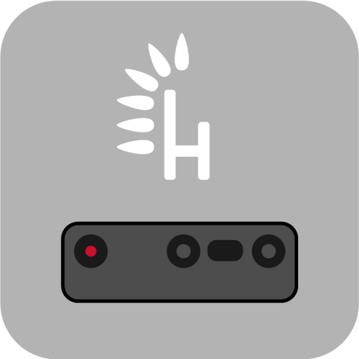

# husarion-depthai-snap

<p align="center">
  
</p>

Snap for OAK-x cameras customized for Husarion robots.

[](https://snapcraft.io/husarion-depthai)

## Install

```bash
sudo snap install husarion-depthai
sudo /var/snap/husarion-depthai/common/post_install.sh   # connects raw-usb, hardware-observe, shm + restarts the daemon
```

`post_install.sh` connects the interfaces snapd does not auto-connect on sideloaded (`--dangerous` / `snap try`) installs; on a Snap Store install it is a no-op safety net.

## Apps

| app | description |
| -- | -- |
| `husarion-depthai.start` | Enable + start the `husarion-depthai.daemon` service |
| `husarion-depthai.stop` | Disable + stop the daemon |
| `husarion-depthai.restart` | Restart the daemon |
| `husarion-depthai` | Run in the foreground (stop the daemon first) |

## Configuration

Two parameter namespaces — `driver.*` (DepthAI) and `ros.*` (DDS / namespace / domain id):

```bash
# DepthAI
sudo snap set husarion-depthai driver.camera-model=OAK-D-PRO
sudo snap set husarion-depthai driver.camera-params=oak-d-pro
sudo snap set husarion-depthai driver.ffmpeg-params=default
sudo snap set husarion-depthai driver.enable-pointcloud=true   # PointCloudXyzrgbNode (RGBD presets only)
sudo snap set husarion-depthai driver.rectify-rgb=false        # skip image_proc::RectifyNode (default: true)
sudo snap set husarion-depthai driver.startup-delay=30         # seconds to sleep on fresh boot (USB cold-start workaround)

# ROS / DDS
sudo snap set husarion-depthai ros.namespace=robot
sudo snap set husarion-depthai ros.domain-id=0
sudo snap set husarion-depthai ros.transport=udp-lo            # or: udp, shm, builtin, rmw_cyclonedds_cpp
```

Dump current settings: `snap get -d husarion-depthai`

## Camera presets

Bundled preset YAMLs live in `/var/snap/husarion-depthai/current/`:

| preset | hardware | pipeline | notes |
| -- | -- | -- | -- |
| `default` | any OAK-x | RGB | 1280×720 @ 30 fps, raw RGB over USB |
| `oak-1-lite` | OAK-1-LITE | RGB | single-sensor IMX214 |
| `oak-d-pro` | OAK-D-PRO | RGBD + IMU + IR | subpixel + lr_check + align_depth |
| `oak-d-pro-poe` | OAK-D-PRO-POE | RGBD + IMU + IR | MJPEG quality 50, default IP `10.15.20.6` |
| `oak-d-pro-slam` | OAK-D-PRO | RGBD + IMU + IR | manual exposure for VIO/SLAM feature trackers |
| `rgb-h264-720p30` | any OAK-x | RGB (chip H.264) | OAK hardware H.264 on `…/rgb/image_raw/compressed` (FFMPEGPacket); no raw/rect/PCL — rectify + point-cloud forced off. fps/res variants: `rgb-h264-{360p30,360p60,720p60,1080p60,4k30}` |
| `depth-disp-h264` | OAK-D-class | depth (chip H.264) | chip H.264 of the 8-bit **disparity** (lossy view, not metric); RGB lazy. For external consumers — the cockpit has no depth viewer |
| `rgb-raw-720p-h264-720p` | any OAK-x | RGB (raw + h264) | raw `…/rgb/image_raw` (autonomy) **and** on-chip H.264 `…/rgb/image_raw/compressed` (telepresence) at once, 720p @ 30 — via the `husarion_depthai_pipeline` plugin |
| `rgb-raw-1080p-h264-1080p` | any OAK-x | RGB (raw + h264) | as above at 1080p, 8.5 Mbps encoded |
| `rgb-raw-360p-h264-360p` | any OAK-x | RGB (raw + h264) | as above at 360p, 1 Mbps encoded — survives weak links |
| `rgb-raw-1080p-h264-720p` | any OAK-x | RGB (raw + h264, asymmetric) | full-res 1080p raw + downscaled 720p H.264 (on-chip ImageManip) |
| `rgb-raw-360p-h264-720p` | any OAK-x | RGB (raw + h264, asymmetric) | lightweight 360p raw + 720p H.264 view |
| `rgbd-rgb-h264-720p-depth-raw-disp-h264` | OAK-D-class | RGB + depth (raw + h264) | RGB raw+H.264 plus depth 16UC1 raw + disparity grayscale-H.264 view (2D depth preview). Verified on OAK-D-LITE; needs a stereo OAK (`i_subpixel` must be false → 8-bit disparity for the encoder) |

The filename carries the format: `rgb-h264-*` = chip H.264 only (no raw); `rgb-raw-*-h264-*` = raw **and** on-chip H.264 at once (the two resolutions are the raw leg and the encoder leg). The `rgb-raw-*` + `rgbd-*` presets use the bundled `husarion_depthai_pipeline` pluginlib plugin (selected via `camera.i_pipeline_type`) — raw + on-chip H.264 from one camera, no host encode. The cockpit telepresence feed auto-follows the on-chip `…/compressed` (badge: `sensor`) while autonomy nodes read the raw topic.

Add your own preset:

```bash
sudo cp /var/snap/husarion-depthai/current/camera-params-default.yaml \
        /var/snap/husarion-depthai/current/camera-params-myconfig.yaml
sudo vim /var/snap/husarion-depthai/current/camera-params-myconfig.yaml
sudo snap set husarion-depthai driver.camera-params=myconfig
```

Bundled presets are overwritten on every `snap refresh`. User-added files (any name not in the bundled list) are preserved.

## FFmpeg image transport

The driver publishes both raw (`/<ns>/<name>/rgb/image_raw`) and ffmpeg-encoded (`/<ns>/<name>/rgb/image_raw/ffmpeg`) variants. Encoder defaults are in `/var/snap/husarion-depthai/current/ffmpeg-params-default.yaml`:

```yaml
ffmpeg_image_transport:
  encoding: libx264
  preset: ultrafast
  tune: zerolatency
```

Available encoders: `ffmpeg -encoders`. Available presets per encoder: `ffmpeg -h encoder=libx264`.

To use a custom config:

```bash
sudo cp /var/snap/husarion-depthai/current/ffmpeg-params-default.yaml \
        /var/snap/husarion-depthai/current/ffmpeg-params-myconfig.yaml
sudo vim /var/snap/husarion-depthai/current/ffmpeg-params-myconfig.yaml
sudo snap set husarion-depthai driver.ffmpeg-params=myconfig
```

## Logs and debugging

```bash
journalctl -t husarion-depthai -f              # tag = SNAP_NAME
snap logs husarion-depthai.daemon -f
snap services husarion-depthai
snap connections husarion-depthai              # raw-usb, hardware-observe, shm-plug↔shm-slot must be connected
cat /var/snap/husarion-depthai/common/ros.env  # exact env exported by the configure hook
```

`DEPTHAI_DEBUG=1` enables `log_level=debug` in the launch file.

## Architecture and contributing

See [ARCHITECTURE.md](ARCHITECTURE.md) for the snap layout and [CLAUDE.md](CLAUDE.md) for the working rules (template re-render, parameter wiring, pitfalls).

## Managing the embedded husarion-agent

This snap embeds **husarion-agent** as a chain **follower** (leaf): it receives ROS networking config (namespace / domain / RMW profiles) from the rosbot snap and applies it locally. Chaining is automatic — there is nothing to configure.

### Pairing

**Same host (zero-config).** Installed alongside the rosbot snap from the store (same publisher), snapd auto-connects this snap's `agent-chain` plug to rosbot and it self-joins via the CSR drop-box. Verify on the robot:

```
rosbot.peer-join peer list       # this snap listed, origin: content
```

Sideloaded / `snap try` installs need a one-time connect:

```
sudo snap connect husarion-depthai:agent-chain rosbot:agent-chain
```

Disconnecting or removing this snap auto-revokes its cert on rosbot.

### Config propagation

Change ROS network params (namespace / domain / RMW) on the **chain owner** (the cockpit host, or the rosbot snap when standalone) — they cascade here automatically and this snap's driver restarts on the new settings. RMW profiles published on rosbot reach this follower's `config/rmw/` and are mirrored to the path the driver reads. The content interface is **same-host only**; chaining to an agent on another host uses the CLI (`husarion-depthai.peer-join join --primary …`).

To add your **own custom RMW profile** (no cockpit), do it once on **rosbot** — drop the XML into its `husarion-agent/config/rmw/<impl>/` source and `snap set rosbot ros.transport=…`; the file and the selection propagate here automatically. Don't add it or set `ros.transport` here directly — the owner reconciles a follower's local change away. See the rosbot README §"Adding a custom RMW profile and propagating it across the chain".

### Inspecting

This follower's cert bundle lives under `$SNAP_COMMON/peer-certs/`. The chain is inspected from the provider: `rosbot.peer-join peer list`.
