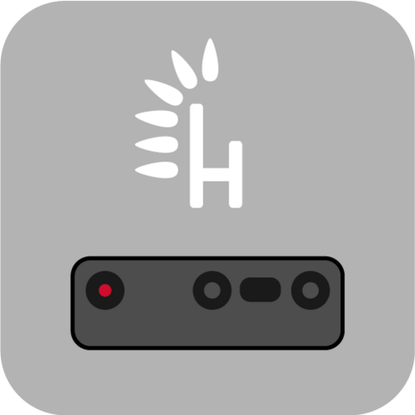

# husarion-depthai-snap

<p align="center">
  
</p>

Snap for OAK-x cameras customized for Husarion robots.

[](https://snapcraft.io/husarion-depthai)

## Install

```bash
sudo snap install husarion-depthai
sudo /var/snap/husarion-depthai/common/post_install.sh   # connects raw-usb, hardware-observe, shm
sudo snap set husarion-depthai driver.model=OAK-D-PRO    # required — the daemon refuses to start unset
sudo husarion-depthai.start
```

`post_install.sh` connects the interfaces snapd does not auto-connect on sideloaded (`--dangerous` / `snap try`) installs; on a Snap Store install it is a no-op safety net. `driver.model` is validation/cockpit metadata (the driver autodetects the device), but it must be declared before the driver starts.

## Apps

| app | description |
| -- | -- |
| `husarion-depthai.start` | Enable + start the `husarion-depthai.daemon` service |
| `husarion-depthai.stop` | Disable + stop the daemon |
| `husarion-depthai.restart` | Restart the daemon |
| `husarion-depthai` | Run in the foreground (stop the daemon first) |

## Configuration

Two parameter namespaces — `driver.*` (DepthAI) and `ros.*` (DDS / namespace / domain id):

```bash
# DepthAI — one base preset, everything else is an orthogonal override
sudo snap set husarion-depthai driver.model=OAK-D-PRO
sudo snap set husarion-depthai driver.resolution=1080P         # default: 720P; 720P|1080P|4K
sudo snap set husarion-depthai driver.fps=30                   # default: 30; 1-60
sudo snap set husarion-depthai driver.depth=true                # default: false — adds metric depth + on-chip H.264 disparity preview (rejected on OAK-1/OAK-1-LITE); implies rectify-rgb=true
sudo snap set husarion-depthai driver.pointcloud=true           # default: false — PointCloudXyzrgbNode; implies (auto-sets) depth=true + rectify-rgb=true
sudo snap set husarion-depthai driver.imu=true                  # default: false; rejected on OAK-1/OAK-1-LITE
sudo snap set husarion-depthai driver.ir=true                   # default: false — IR laser dot projector + floodlight; rejected unless OAK-D-PRO/OAK-D-PRO-W
sudo snap set husarion-depthai driver.ip=10.15.20.6              # default: unset (USB) — PoE target
sudo snap set husarion-depthai driver.rectify-rgb=false         # skip image_proc::RectifyNode (default: true) — also disables depth + pointcloud if either was on
sudo snap set husarion-depthai driver.startup-delay=30          # seconds to sleep on fresh boot (USB cold-start workaround)
sudo snap set husarion-depthai driver.bitrate=3400000           # default: 3400000; 500000-20000000 — on-chip H.264 encoder bitrate (bit/s), static CBR

# ROS / DDS
sudo snap set husarion-depthai ros.namespace=robot
sudo snap set husarion-depthai ros.domain-id=0
sudo snap set husarion-depthai ros.transport=udp-lo            # or: udp, shm, builtin, rmw_cyclonedds_cpp
```

Dump current settings: `snap get -d husarion-depthai`

## Camera config

`driver.camera-params` has two modes:

- **`autogenerated`** (the default) — `camera-params-autogenerated.yaml` is compiled fresh from `driver.depth`/`resolution`/`fps`/`imu`/`ir`/`ip`/`bitrate` on **every** `snap set` (`generate_camera_params.sh`, run by the `configure` hook). Always the custom `husarion_depthai_pipeline` dual-output plugin: raw RGB (autonomy) **and** on-chip H.264 (telepresence) from a single camera at once, no host encode — works on every OAK-x, including single-sensor OAK-1/OAK-1-LITE.
- **anything else** — a hand-authored file, fully hands-off: none of the keys below have any effect on it (that file's own values are used verbatim), and it's never touched by `configure`.

While in `autogenerated` mode, everything an operator chooses is a `driver.*` key, not a different file to pick:

| key | default | effect |
| -- | -- | -- |
| `driver.resolution` | `720P` | overrides `rgb.i_resolution` (`720P`/`1080P`/`4K`) |
| `driver.fps` | `30` | overrides `rgb.i_fps` + the H.264 keyframe cadence (1-60) |
| `driver.depth` | `false` | switches the pipeline to also produce depth (metric raw + an on-chip H.264 disparity preview) — capability-gated on the camera having a stereo pair; **implies `driver.rectify-rgb=true`** |
| `driver.pointcloud` | `false` | loads `PointCloudXyzrgbNode` — **implies `driver.depth=true`** (auto-set; verified against upstream `depthai-ros`, which never runs PCL without an RGBD pipeline — the node's depth input topic simply doesn't exist otherwise), which in turn implies `driver.rectify-rgb=true` |
| `driver.imu` | `false` | toggles the IMU — capability-gated per model |
| `driver.ir` | `false` | toggles IR **laser dot projector + floodlight together** (one upstream switch drives both, at fixed default intensity) — the dot projector helps stereo depth accuracy in low-light/textureless scenes, the floodlight illuminates the scene generally; capability-gated (`OAK-D-PRO`/`OAK-D-PRO-W` only) |
| `driver.ip` | *(unset)* | PoE target address — the one key that stays unset by default (USB is the common case) |
| `driver.bitrate` | `3400000` | overrides the on-chip H.264 encoder's bitrate (bit/s), static CBR — **not** runtime-adjustable, changing it restarts the daemon |

All are `snap set`-only, capability-checked in `snap/hooks/configure` before they ever reach the generated file — a rejected value (e.g. `depth=true` on an OAK-1-LITE) errors immediately with a clear reason instead of failing silently at runtime. In a Husarion cockpit install, the "Camera" Manage card exposes the exact same keys as fields, and always drives `autogenerated` — cockpit and a headless `snap set` land on the identical `driver.*` values and the identical generated file.

Need something these can't express (asymmetric raw/encoder sizing, manual exposure tuning for SLAM, a second stereo profile)? Switch to a custom file:

```bash
sudo cp /var/snap/husarion-depthai/current/camera-params-autogenerated.yaml \
        /var/snap/husarion-depthai/current/camera-params-myconfig.yaml
sudo vim /var/snap/husarion-depthai/current/camera-params-myconfig.yaml
sudo snap set husarion-depthai driver.camera-params=myconfig
```

The moment `driver.camera-params` isn't `autogenerated`, generation stops entirely — `depth`/`resolution`/`fps`/`imu`/`ir`/`ip`/`bitrate` become inert (harmlessly ignored, logged, never applied) and `camera-params-myconfig.yaml` is 100% yours: hand-edit any depthai_ros_driver parameter, including ones the keys above don't expose. `camera-params-autogenerated.yaml` is rewritten on every `snap set` (and every `snap refresh`); a custom-named file is not touched by this snap at all — `snap set driver.camera-params=autogenerated` switches back.

## Encoded rectified RGB (`image_rect`)

`.../oak/rgb/image_raw` gets on-chip H.264 for free (`.../image_raw/ffmpeg`, above) — but that tap is on the RAW, pre-rectification frame. The **rectified** image (`.../oak/rgb/image_rect`, from `image_proc::RectifyNode`, only published when `driver.rectify-rgb=true`) has no hardware encode path at all, so this snap still carries a real, host-CPU `ffmpeg_image_transport` for it specifically:

```bash
sudo snap set husarion-depthai driver.ffmpeg-params=default   # already the default
```

Config lives in `/var/snap/husarion-depthai/current/ffmpeg-params-default.yaml` (encoder `libx264`, 2 Mbps, `preset:ultrafast,tune:zerolatency`). It's lazy — zero CPU unless something actually subscribes to `.../image_rect/ffmpeg`. To customize:

```bash
sudo cp /var/snap/husarion-depthai/current/ffmpeg-params-default.yaml \
        /var/snap/husarion-depthai/current/ffmpeg-params-myconfig.yaml
sudo vim /var/snap/husarion-depthai/current/ffmpeg-params-myconfig.yaml
sudo snap set husarion-depthai driver.ffmpeg-params=myconfig
```

## Logs and debugging

```bash
journalctl -t husarion-depthai -f              # tag = SNAP_NAME
snap logs husarion-depthai.daemon -f
snap services husarion-depthai
snap connections husarion-depthai              # raw-usb, hardware-observe, shm-plug↔shm-slot must be connected
cat /var/snap/husarion-depthai/common/ros.env  # exact env exported by the configure hook
```

`DEPTHAI_DEBUG=1` enables `log_level=debug` in the launch file.

## Architecture and contributing

See [ARCHITECTURE.md](ARCHITECTURE.md) for the snap layout and [CLAUDE.md](CLAUDE.md) for the working rules (template re-render, parameter wiring, pitfalls).

## Managing the embedded husarion-agent

This snap embeds **husarion-agent** as a chain **follower** (leaf): it receives ROS networking config (namespace / domain / RMW profiles) from the rosbot snap and applies it locally. Chaining is automatic — there is nothing to configure.

### Pairing

**Same host (zero-config).** Installed alongside the rosbot snap from the store (same publisher), snapd auto-connects this snap's `agent-chain` plug to rosbot and it self-joins via the CSR drop-box. Verify on the robot:

```
rosbot.peer-join peer list       # this snap listed, origin: content
```

Sideloaded / `snap try` installs need a one-time connect:

```
sudo snap connect husarion-depthai:agent-chain rosbot:agent-chain
```

Disconnecting or removing this snap auto-revokes its cert on rosbot.

### Config propagation

Change ROS network params (namespace / domain / RMW) on the **chain owner** (the cockpit host, or the rosbot snap when standalone) — they cascade here automatically and this snap's driver restarts on the new settings. RMW profiles published on rosbot reach this follower's `config/rmw/` and are mirrored to the path the driver reads. The content interface is **same-host only**; chaining to an agent on another host uses the CLI (`husarion-depthai.peer-join join --primary …`).

To add your **own custom RMW profile** (no cockpit), do it once on **rosbot** — drop the XML into its `husarion-agent/config/rmw/<impl>/` source and `snap set rosbot ros.transport=…`; the file and the selection propagate here automatically. Don't add it or set `ros.transport` here directly — the owner reconciles a follower's local change away. See the rosbot README §"Adding a custom RMW profile and propagating it across the chain".

### Inspecting

This follower's cert bundle lives under `$SNAP_COMMON/peer-certs/`. The chain is inspected from the provider: `rosbot.peer-join peer list`.
