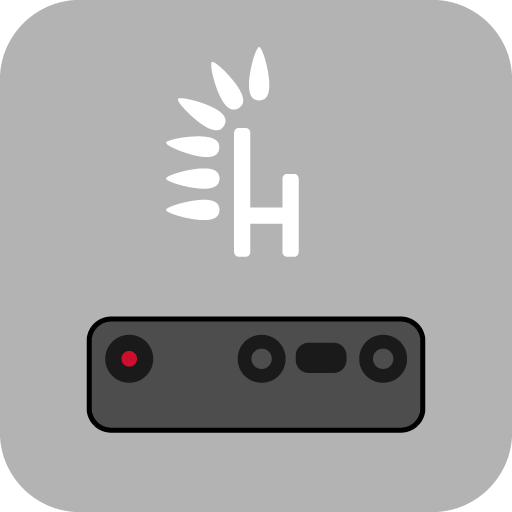

# husarion-depthai-snap

<p align="center">
  
</p>

Snap for OAK-x cameras customized for Husarion robots

[](https://snapcraft.io/husarion-depthai)


## Apps

| app | description |
| - | - |
| `husarion-depthai.start` | Start the `husarion-depthai.daemon` service |
| `husarion-depthai.stop` | Stop the `husarion-depthai.daemon` service |
| `husarion-depthai` | Start the application in the foreground (run in the current terminal). Remember to stop the daemon first |

## Setup Camera Params

The default config parameters for camera node are selected with:

```bash
$ sudo snap set husarion-depthai driver.camera-config=default
```

The default config is get from: `/var/snap/husarion-depthai/common/camera-config-default.yaml` file:

```yaml
---
/**:
  ros__parameters:
    camera:
      i_calibration_dump: false
      i_enable_imu: false
      i_enable_ir: false
      i_external_calibration_path: ''
      i_floodlight_brightness: 0
      i_ip: ''
      i_laser_dot_brightness: 800
      i_mx_id: ''
      i_nn_type: none
      i_pipeline_dump: false
      i_pipeline_type: RGB
      i_publish_tf_from_calibration: false
      i_restart_on_diagnostics_error: false
      i_usb_port_id: ''
      i_usb_speed: SUPER_PLUS
    diagnostic_updater:
      period: 1.0
    imu:
      i_acc_cov: 0.0
      i_acc_freq: 400
      i_batch_report_threshold: 5
      i_enable_rotation: false
      i_get_base_device_timestamp: false
      i_gyro_cov: 0.0
      i_gyro_freq: 400
      i_mag_cov: 0.0
      i_max_batch_reports: 10
      i_message_type: IMU
      i_rot_cov: -1.0
      i_sync_method: LINEAR_INTERPOLATE_ACCEL
      i_update_ros_base_time_on_ros_msg: false
    rgb:
      i_add_exposure_offset: false
      i_board_socket_id: 0
      i_calibration_file: ''
      i_disable_node: false
      i_enable_feature_tracker: false
      i_enable_lazy_publisher: false #true
      i_enable_nn: false
      i_enable_preview: false
      i_exposure_offset: 0
      i_fps: 20.0
      i_fsync_continuous: false
      i_fsync_trigger: false
      i_get_base_device_timestamp: false
      i_height: 432 #720
      i_interleaved: false
      i_isp_den: 5 #3 #3 valid if i_output_isp: true
      i_isp_num: 2 #2 valid if i_output_isp: true
      i_keep_preview_aspect_ratio: true
      i_low_bandwidth: true #false
      i_low_bandwidth_quality: 20
      i_max_q_size: 30
      # i_width: 1280 #valid if i_output_isp: false
      # i_height: 720 #valid if i_output_isp: false
      # i_interleaved: false
      # scaling 1920x1080 1:3 to 640x360
      # https://docs-beta.luxonis.com/develop/ros/depthai-ros-driver#Available%20sensors%20and%20their%20resolutions%3A
      # IMX378, 1080P is 1920x1080, i_isp_den=3 and i_isp_num=2 will give 1280x720 (/16=)
      i_output_isp: true
      i_preview_height: 300
      i_preview_size: 300
      i_preview_width: 300
      i_publish_topic: true
      i_resolution: 1080P
      i_reverse_stereo_socket_order: false
      i_sensor_img_orientation: AUTO
      i_set_isp3a_fps: false
      i_set_isp_scale: true
      i_simulate_from_topic: false
      i_simulated_topic_name: ''
      i_update_ros_base_time_on_ros_msg: false
      i_width: 768 #1280
      r_exposure: 20000
      r_focus: 1
      r_iso: 800
      r_set_man_exposure: false
      r_set_man_focus: false
      r_set_man_whitebalance: false
      r_whitebalance: 3300
    use_sim_time: false

```

You can create your own config file: `/var/snap/husarion-depthai/common/camera-config-<MY_NAME>.yaml`:

```bash
sudo cp \
/var/snap/husarion-depthai/camera-config-default.yaml \
/var/snap/husarion-depthai/camera-config-myconfig.yaml
```

Modify the content of the `camera-config-myconfig.yaml` file, eg:

```bash
sudo vim /var/snap/depthai-camera/common/camera-config-myconfig.yaml
```

And set the new path to the config file:

```bash
sudo snap set depthai-camera driver.camera-params=myconfig
```

## Setup FFMPEG Params

The default values for `ffmpeg-image-transport` are:

```bash
$ sudo snap set husarion-depthai driver.ffmpeg-config=default
```

The default config is get from: `/var/snap/husarion-depthai/common/ffmpeg-config-default.yaml` file:

```yaml
---
/**:
  ros__parameters:
    ffmpeg_image_transport:

      # find the list of available encoders by running `ffmpeg -encoders`
      encoding: libx264
      
      # find the list of available presets by running `ffmpeg -h encoder=libx264`
      preset: ultrafast
      tune: zerolatency
```

You can create your own config file: `/var/snap/husarion-depthai/common/ffmpeg-config-<MY_NAME>.yaml`:

```bash
sudo cp \
/var/snap/husarion-depthai/ffmpeg-config-default.yaml \
/var/snap/husarion-depthai/ffmpeg-config-myconfig.yaml
```

Modify the content of the `ffmpeg-config-myconfig.yaml` file, eg:

```bash
sudo vim /var/snap/husarion-depthai/common/ffmpeg-config-myconfig.yaml
```

And set the new path to the config file:

```bash
sudo snap set husarion-depthai driver.ffmpeg-params=myconfig
```

To check available options run:

```bash
ffmpeg -encoders
```

find the list of available presets by running

```bash
ffmpeg -h encoder=$SELECTED_ENCODER`
```
